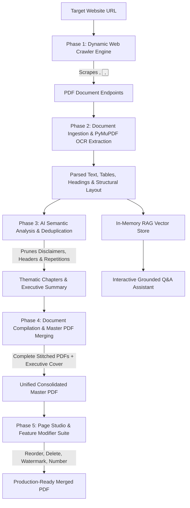

# AI PDF Crawler & Synthesizer 🌿📄

[](https://www.python.org/)
[](https://fastapi.tiangolo.com/)
[](https://react.dev/)
[](https://vitejs.dev/)
[](https://tailwindcss.com/)
[](LICENSE)

> **An intelligent, autonomous end-to-end web platform designed to discover, extract, deduplicate, organize, and merge online PDF documents into a unified publication-ready master PDF with integrated RAG chat and interactive visual page studio.**

Given any target website URL, the application autonomously scans the entire site, extracts PDF documents (even those nested inside buttons, dropdowns, JavaScript triggers, or viewer frames), filters redundant content using AI/NLP, compiles all documents into a complete merged master PDF, and lets users visually reorganize, stamp, watermark, or edit pages before downloading.

---

## 📑 Table of Contents

- [Key Features](#-key-features)
- [System Architecture & Workflow](#-system-architecture--workflow)
- [Tech Stack](#-tech-stack)
- [Project Directory Structure](#-project-directory-structure)
- [Quick Start Guide](#-quick-start-guide)
  - [Prerequisites](#prerequisites)
  - [Option A: Automated 1-Click Setup (Windows)](#option-a-automated-1-click-setup-windows)
  - [Option B: Manual Setup (Windows / macOS / Linux)](#option-b-manual-setup-windows--macos--linux)
- [Environment Variables & AI Models](#-environment-variables--ai-models)
- [Interactive Page Studio & Modifier Suite](#-interactive-page-studio--modifier-suite)
- [API Endpoints Reference](#-api-endpoints-reference)
- [License](#-license)

---

## ✨ Key Features

1. **Deep Autonomous Web Crawler**:
   - Discovers PDF files across single landing pages or recursively across entire host domains.
   - Detects direct links (`<a href="...pdf">`), downloadable buttons (`<button data-url="...">`), `onclick` handlers, dynamic JS window locations, and embedded viewers (Google Docs Viewer, PDF.js, `<iframe>`, `<embed>`, `<object>`).
   - Built-in anti-bot headers, User-Agent rotation, robots.txt compliance, and Brotli/Gzip decompression.

2. **Full Master Document Compilation**:
   - Collects, downloads, and stitches **all discovered PDFs into a single, unified master file**.
   - Optional publication-grade ReportLab executive cover report, deduplication audit, and interactive Table of Contents.

3. **Intelligent AI Deduplication & Synthesis**:
   - Cross-document semantic analysis identifying repetitive headers/footers, identical disclaimers, duplicate corporate intro statements, and duplicate policies.
   - Generates high-level 250–400 word executive summaries and structured chapter TOCs.
   - Tri-mode AI engine: **Google Gemini 2.5 Flash**, **OpenAI GPT-4o-mini**, or **100% Offline Local TF-IDF & Heuristic NLP Synthesizer** (runs anywhere with zero API keys required).

4. **Interactive Merged PDF Page Studio & Modifier**:
   - **Add & Combine Local PC PDFs**: Upload PDF documents directly from your computer storage (via button or drag-and-drop into the studio) to seamlessly merge, reorder, and combine your own files with crawled documents.
   - **Fluid Drag-and-Drop Reordering**: Change page sequence across the master PDF effortlessly.
   - **Page Rotation & Deletion**: Rotate individual or batch-selected pages (90°/180°/270°) and remove unwanted pages.
   - **Running Page Numbers**: Stamp custom patterns (e.g., `Page {page} of {total}`) across headers or footers with position and color controls.
   - **Watermarking Suite**: Stamp diagonal or horizontal security watermarks (`CONFIDENTIAL`, `DRAFT`, custom text) with opacity sliders.
   - **Lossless Deflater / Optimizer**: Reduces merged PDF size using garbage collection and stream deflating.
   - **Metadata Editor**: Update embedded Document Title, Author, and Subject.
   - **Custom Range Extraction**: Split and export custom page intervals (`e.g., 1-5, 12-18`).

5. **Grounded RAG AI Assistant**:
   - Integrated semantic Q&A chatbot over the entire crawled document library.
   - Answers questions strictly grounded in the ingested PDFs with accurate source citations (`[Filename, Page #]`).

6. **Refined Eye-Friendly UI**:
   - Softer grayish-white background (`#f4f6f8`) that reduces glare and eye strain.
   - High-contrast deep black typography with vibrant leaf green (`#16a34a`) action buttons and indicators.

---

## 🏗 System Architecture & Workflow



---

## 🛠 Tech Stack

| Layer | Technologies |
|---|---|
| **Frontend** | React 19, Vite 8, Tailwind CSS v4, Lucide Icons, Canvas-Confetti |
| **Backend** | Python 3.10+, FastAPI, Uvicorn, Pydantic v2 |
| **Web Crawling** | Async HTTPX, BeautifulSoup4, Brotli, Anti-bot Header Rotation |
| **PDF Processing** | PyMuPDF (`fitz`), PyPDF, ReportLab |
| **AI / NLP** | Google Gemini API, OpenAI API, Scikit-learn (TF-IDF Cosine Similarity) |
| **Streaming** | Server-Sent Events (SSE) via `sse-starlette` |

---

## 📁 Project Directory Structure

```
AI_DRIVEN_PDF_CRAWLER_SYNTHESIZER/
├── backend/
│   ├── crawler.py           # Multi-strategy crawler (<a>, buttons, viewers, recursion)
│   ├── jobs.py              # In-memory thread-safe pipeline state & SSE event stream
│   ├── main.py              # FastAPI endpoints, background tasks, page studio APIs
│   ├── merger.py            # PDF stitching, page reordering, watermarks, numbering, deflater
│   ├── processor.py         # Streaming downloader, PyMuPDF OCR & layout parser
│   ├── rag.py               # In-memory TF-IDF vector retrieval & source citation
│   ├── sample_data.py       # Instant offline sample PDFs generator
│   ├── sample_pdfs/         # Bundled offline enterprise demo documents
│   ├── storage/             # Runtime job workspace (.gitignore tracked with .gitkeep)
│   ├── synthesizer.py       # Tri-mode AI deduplication & executive summary engine
│   ├── requirements.txt     # Python backend dependencies
│   └── .env.example         # Backend environment variables template
├── frontend/
│   ├── public/              # Static assets and favicon
│   ├── src/
│   │   ├── components/
│   │   │   ├── HeroSection.jsx           # URL input, single/entire site toggle, crawl CTA
│   │   │   ├── MasterDownloadHub.jsx     # Master PDF download CTA, ZIP export, studio button
│   │   │   ├── Navbar.jsx                # Sticky navbar with settings & RAG toggles
│   │   │   ├── PDFModal.jsx              # Document viewer modal
│   │   │   ├── PDFPageOrganizerModal.jsx # Drag-and-drop page studio & modifier suite
│   │   │   ├── PDFPreviewGrid.jsx        # Discovered PDFs cards with selection checks
│   │   │   ├── ProgressBar.jsx           # Live SSE pipeline progress & terminal logs
│   │   │   ├── RAGChatSidebar.jsx        # Grounded Q&A chat assistant sidebar
│   │   │   ├── SettingsModal.jsx         # Custom API keys & crawler depth settings
│   │   │   └── SynthesisSection.jsx      # AI Executive summary & thematic chapters
│   │   ├── App.jsx                       # Main state coordinator & layout
│   │   ├── index.css                     # Tailwind CSS v4 & leaf-green theme styles
│   │   └── main.jsx                      # React entrypoint
│   ├── package.json         # Frontend dependencies & scripts
│   └── vite.config.js       # Vite configuration with API proxy to port 8000
├── .env.example             # Root environment variables template
├── .gitignore               # Comprehensive Git ignore rules
├── README.md                # Project documentation
├── SETUP_GUIDE.md           # Step-by-step new computer setup guide
├── setup_new_computer.bat   # 1-click Windows automated setup script
├── start.bat                # 1-click Windows runner (auto-repairs dependencies)
└── start.ps1                # PowerShell launcher script
```

---

## 🚀 Quick Start Guide

### Prerequisites
- **Python**: Version 3.10, 3.11, or 3.12 ([python.org](https://www.python.org/downloads/)) — *ensure "Add python.exe to PATH" is checked during installation.*
- **Node.js**: Version 18, 20, or 22 LTS ([nodejs.org](https://nodejs.org/))

---

### Option A: Automated 1-Click Setup (Windows)

1. Clone or download this repository:
   ```bash
   git clone https://github.com/your-username/AI_DRIVEN_PDF_CRAWLER_SYNTHESIZER.git
   cd AI_DRIVEN_PDF_CRAWLER_SYNTHESIZER
   ```
2. Double-click `start.bat` (or run `./start.bat` in Command Prompt / PowerShell).
   - *It will automatically detect if `venv` or `node_modules` is missing, run full installation, and launch both backend and frontend servers!*

---

### Option B: Manual Setup (Windows / macOS / Linux)

#### 1. Backend Setup:
```bash
# Navigate to backend
cd backend

# Create virtual environment
python -m venv venv

# Activate virtual environment
# Windows (PowerShell):
venv\Scripts\Activate.ps1
# Windows (CMD):
venv\Scripts\activate.bat
# macOS / Linux:
source venv/bin/activate

# Install dependencies
pip install --upgrade pip
pip install -r requirements.txt

# Start backend server
uvicorn main:app --host 127.0.0.1 --port 8000 --reload
```
*Backend is live at `http://127.0.0.1:8000` (Interactive API docs at `http://127.0.0.1:8000/docs`).*

#### 2. Frontend Setup:
```bash
# In a new terminal, navigate to frontend
cd frontend

# Install npm dependencies
npm install

# Start Vite dev server
npm run dev
```
*Frontend is live at `http://localhost:5173`.*

---

## ⚙️ Environment Variables & AI Models

By default, the platform runs **100% locally with zero external API keys needed** using built-in scikit-learn TF-IDF and heuristic semantic clustering.

To enable advanced LLM summarization (OpenAI or Google Gemini), copy `.env.example` to `.env`:

```env
# Optional: OpenAI GPT-4o-mini
OPENAI_API_KEY=your_openai_api_key_here

# Optional: Google Gemini 2.5 Flash
GEMINI_API_KEY=your_gemini_api_key_here

# Server host & ports
BACKEND_HOST=127.0.0.1
BACKEND_PORT=8000
FRONTEND_PORT=5173
```
*You can also paste API keys directly into the UI via the **Settings (gear icon)** modal.*

---

## 🎨 Interactive Page Studio & Modifier Suite

Once a crawl and merge job completes, click **"Organize & Modify Pages"** on the Master Download Hub to access the Visual Studio:

- **Add & Combine Local PC PDFs**: Click *"Add PDF from PC"* or drag-and-drop local `.pdf` files directly onto the studio to combine them with web documents.
- **Drag-and-Drop Reordering**: Drag page thumbnails to rearrange document structure.
- **Batch Actions**: Select multiple pages using checkboxes or range syntax (`1-5, 8, 12`) to delete or rotate in bulk.
- **Dynamic Page Numbering**: Choose position (`Bottom Center`, `Top Right`, etc.), custom format patterns, font size, and color.
- **Watermarking**: Stamp diagonal draft/confidential or custom text with live opacity sliders.
- **Deflater**: Run lossless image/stream compression to reduce file size.
- **Metadata Editing**: Customize embedded title, author, and subject tags.

---

## 🔌 API Endpoints Reference

| Method | Endpoint | Description |
|---|---|---|
| `POST` | `/api/pipeline/start` | Start autonomous crawl, ingestion, synthesis, and merge job |
| `GET` | `/api/pipeline/{job_id}/stream` | SSE real-time event stream for phase, progress, and logs |
| `GET` | `/api/jobs/{job_id}` | Retrieve complete job state and discovered document metadata |
| `POST` | `/api/jobs/{job_id}/re-merge` | Re-merge custom subset of selected PDFs |
| `GET` | `/api/jobs/{job_id}/master-pdf` | Download the compiled unified master PDF |
| `GET` | `/api/jobs/{job_id}/download-zip` | Download ZIP archive of all original PDFs |
| `GET` | `/api/jobs/{job_id}/pages` | Get metadata and thumbnails of all pages in the master PDF |
| `POST` | `/api/jobs/{job_id}/upload-local-pdf` | Upload and combine local PDF files from computer into master document |
| `POST` | `/api/jobs/{job_id}/edit-pages` | Apply custom page sequence, rotations, or deletions to master PDF |
| `POST` | `/api/jobs/{job_id}/apply-page-numbers` | Stamp running headers/footers with page numbering |
| `POST` | `/api/jobs/{job_id}/apply-watermark` | Stamp custom text watermark across pages |
| `POST` | `/api/jobs/{job_id}/optimize-pdf` | Losslessly deflate and optimize master PDF file size |
| `POST` | `/api/jobs/{job_id}/update-metadata` | Edit embedded document metadata |
| `POST` | `/api/jobs/{job_id}/extract-range` | Extract and download specific page sub-ranges |
| `POST` | `/api/chat` | Query RAG assistant with grounded citations |

---

## 📄 License

This project is licensed under the [MIT License](LICENSE). You are free to use, modify, and distribute this software.
